# 阿婆干饭社 —— 单店点餐微信小程序（全栈个人项目）

> 扫码点餐 · 堂食/外卖双履约 · 模拟支付 · 完整订单/退款状态机 · AI 智能问答（RAG）
>
> 个人全栈练手项目：需求设计、数据库、后端接口、管理端页面、小程序页面均独立完成，供本人与朋友实际使用。

## 项目简介

「阿婆干饭社」是一家虚构的单店家常菜馆。本项目为它实现了一整套线上点餐系统：

- **顾客端**：微信小程序（uniapp + Vue3 + wot-design-uni），支持扫码带入桌号点餐、外卖配送下单；
- **商家端**：基于 RuoYi-Vue 的 Web 管理后台，覆盖店铺/菜单/订单/退款/留言/数据看板/实时新单提醒/小票打印；
- **AI 能力**：基于 Spring AI + RAG 的点餐助手「问问阿婆」，商家上传知识库文档后可基于知识库与在售菜品回答顾客提问。

> ⚠️ **声明**：支付为本地模拟（不发生真实扣款），仅用于学习演示；真实微信支付接入需要商户资质，代码已按策略模式预留扩展点。

## 功能一览

### 顾客端（微信小程序）

| 模块 | 说明 |
|---|---|
| 登录与扫码 | 微信登录（Redis token 登录态）、扫码进入自动带入桌号 |
| 点餐 | 分类菜单（Redis 缓存）、搜索、规格（差价）/口味多选、菜品级+规格级售罄、每日限量库存与自动售罄、剩余库存展示 |
| 购物车 | 加购/改量/清空、失效菜品拦截 |
| 下单 | 堂食绑桌号 / 外卖地址簿+地址快照、配送费与起送价校验、订单备注（快捷模板）、防重锁 |
| 支付 | 模拟支付（策略模式 PaymentService，金额以服务端库内为准、多重幂等校验）、10 分钟未支付自动关单（RocketMQ 延迟消息 + 定时任务兜底） |
| 订单 | 全状态流转可视化、进度条、骑手取餐状态细分、超时关单、取消订单、再次购买（逐项校验） |
| 退款 | 仅整单、限主状态 1–3、配送中引导联系商家、24 小时未审核自动驳回、驳回后可再次申请 |
| 留言/评价 | 购买后可留言（文字+图片+评分）、可关联订单、已完成订单「去评价」提醒 |
| 收藏 | 菜品❤收藏、收藏列表加购 |
| AI 助手 | RAG 知识库问答，多轮对话，防编造、标注知识来源 |

### 商家端（RuoYi Web 管理后台）

| 模块 | 说明 |
|---|---|
| 店铺管理 | 营业状态一键打烊（打烊拦截下单）、配送费/起送价 |
| 菜品管理 | 分类/菜品/规格/口味、图片上传（库内只存相对路径）、售罄标记、每日限量 |
| 订单管理 | 严格状态机流转（条件更新幂等）、骑手已取餐操作、出餐/取餐/送达时间记录、小票打印（浏览器打印 80mm 热敏版式） |
| 退款审核 | 待审核角标、展示用户联系方式与金额、通过/驳回/超时自动驳回 |
| 留言管理 | 关联订单标识、回复/删除、敏感词过滤（配置文件词库） |
| 数据看板 | 营业额/净营业额/客单价/退款率、营业趋势（天/小时）、菜品排行与退款关联、分类占比、高峰时段、出餐效率（接单/制作/取餐/配送耗时） |
| 实时提醒 | 原生 WebSocket 新订单推送 + 浏览器语音播报 |

## 技术栈

| 层 | 技术 |
|---|---|
| 后端 | Java 17 · Spring Boot · RuoYi-Vue · MyBatis-Plus |
| 数据 | MySQL 8 · Redis（Cache-Aside 缓存 / 分布式 setnx 防重锁） |
| 异步 | Apache RocketMQ（延迟消息关单、事件消息）· WebSocket |
| AI | Spring AI · OpenAI 兼容协议（通义千问/百炼）· Redis 向量库（RAG） |
| 顾客端 | uniapp · Vue3 · wot-design-uni（可爱风主题） |
| 商家端 | Vue3 · Element Plus · ECharts |
| 环境 | Docker Compose 一键启动 MySQL + Redis + RocketMQ |

## 架构与设计亮点

1. **订单主状态与退款状态分离**：主状态（0–6）只表达业务流转，退款独立 `refund_status` + 退款单审核状态，驳回后主状态不变、流转自动恢复，无状态歧义。
2. **全链路幂等**：支付、取消、接单/出餐/送达、退款审核一律条件更新（where 前置状态）+ 影响行数校验；下单/退款防重锁；库存条件扣减防超卖（四入口幂等释放）。
3. **RocketMQ 延迟消息**关单 + 定时任务双兜底，提供 `rocketmq.enabled` 降级开关，无 MQ 环境也能跑通。
4. **Cache-Aside 缓存**：店铺/菜单只删不更新缓存；订单等交易数据不缓存，保证强一致。
5. **销量在支付事务内同步累加**，MQ 事件不承担销量职责，避免双通道重复累加。
6. **图片存储规范**：数据库只存名称+相对路径，展示统一拼 URL 前缀，后续迁 OSS 零表结构改动。
7. **RAG 知识库问答**：文档解析 → 切片 → 向量化 → 检索 TopK → 结合在售菜品生成回答。

## 项目截图

> 截图为本地联调实拍，数据均为测试数据。

### 顾客端（微信小程序）

<table>
  <tr>
    <td align="center">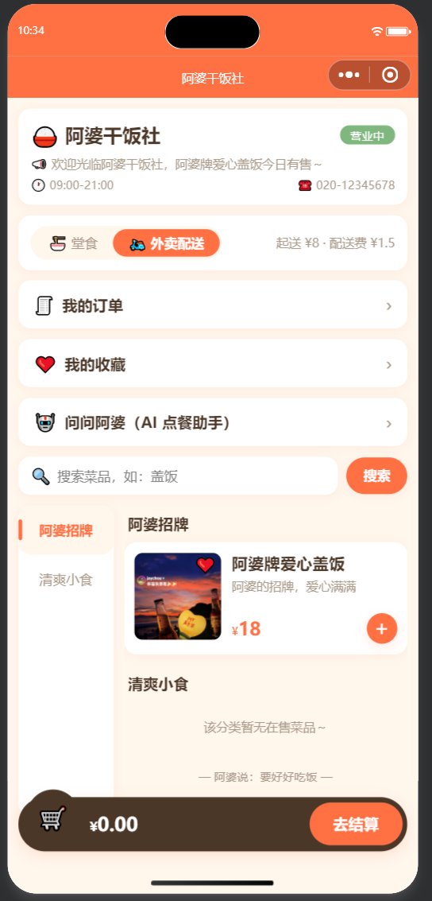<br/><b>首页</b>：堂食/外卖切换 · 分类菜单（Redis 缓存）· 收藏与 AI 入口</td>
    <td align="center">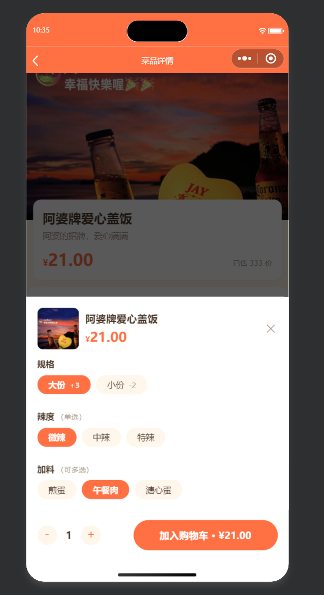<br/><b>菜品详情</b>：规格差价与口味选择 · 售罄置灰 · 剩余库存</td>
    <td align="center">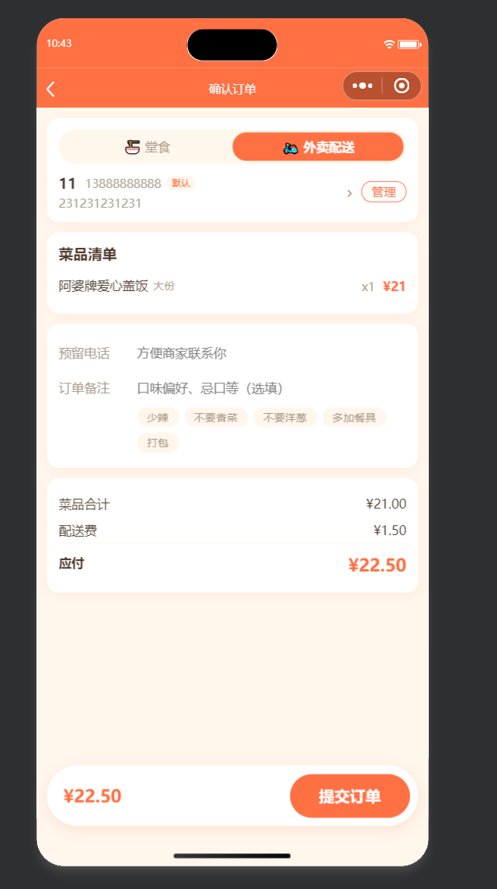<br/><b>提交订单</b>：地址快照 · 备注快捷标签 · 配送费快照</td>
  </tr>
  <tr>
    <td align="center">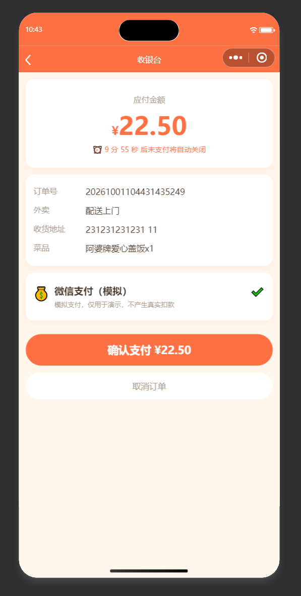<br/><b>收银台</b>：待支付倒计时 · 模拟支付（标注仅演示）</td>
    <td align="center">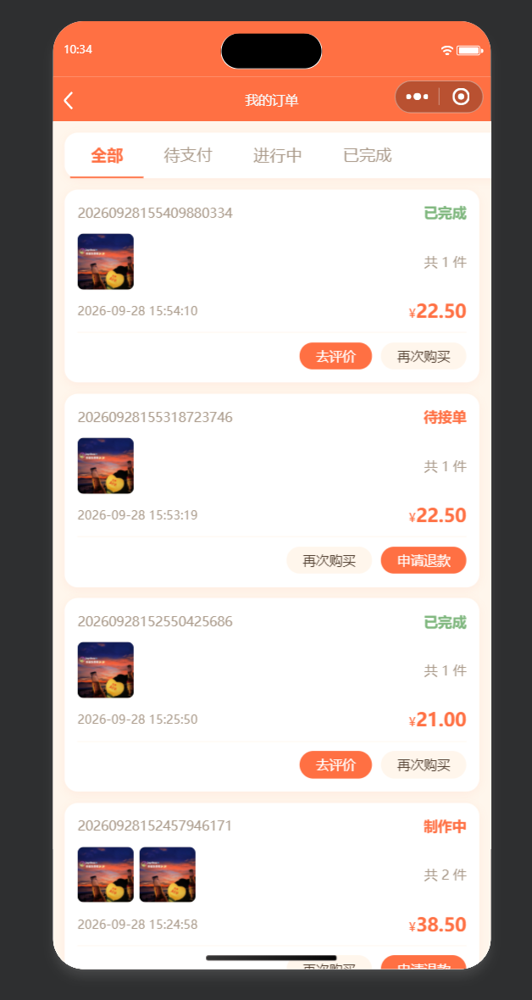<br/><b>我的订单</b>：退款状态优先 · 去评价/再次购买/申请退款</td>
    <td align="center">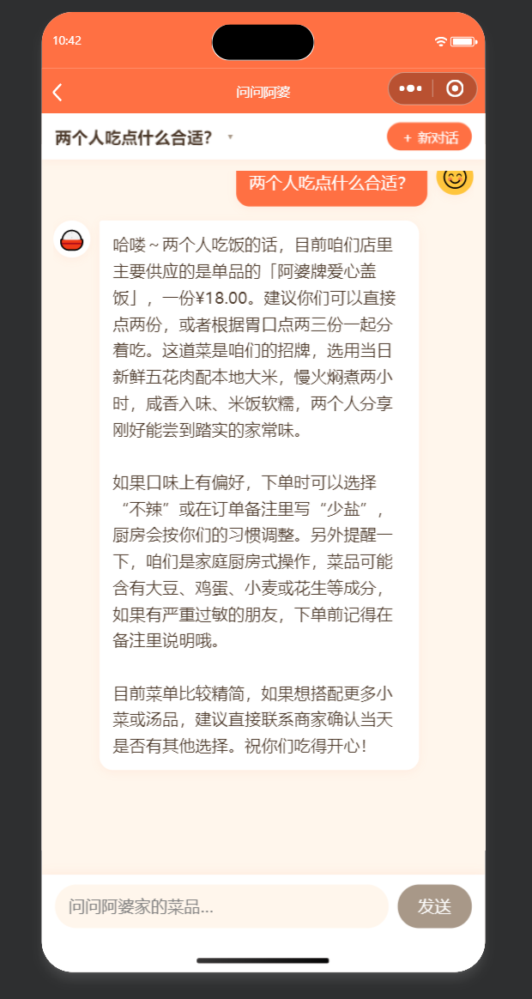<br/><b>AI 智能问答</b>：RAG + 流式输出 · 基于知识库与在售菜品</td>
  </tr>
</table>

### 商家端（RuoYi Web 管理后台）

**订单管理**——状态机流转按钮（接单→出餐→骑手已取餐→完成）、打印入口、退款状态优先展示：

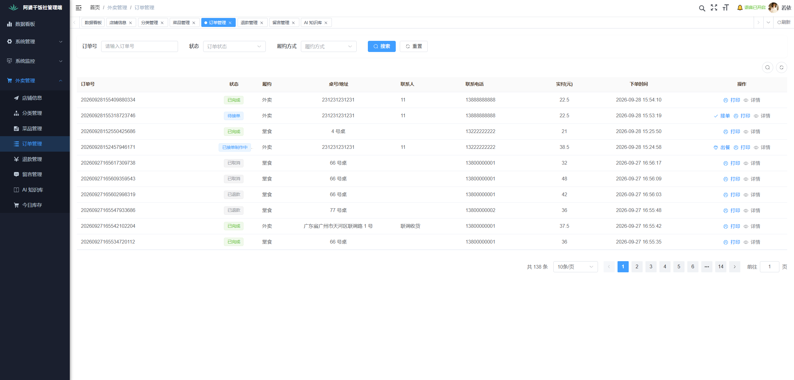

**菜品管理**——图片上传、规格差价/售罄开关/每日限量、口味组编辑：

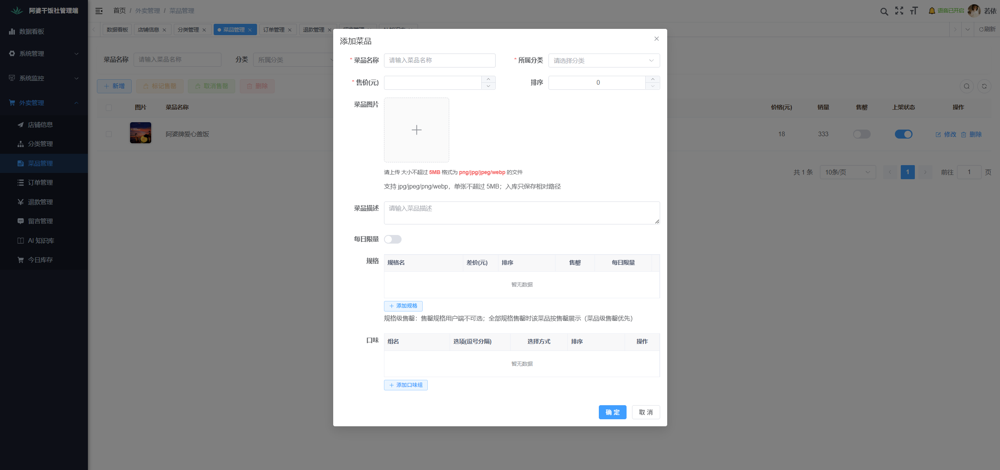

**数据看板**——净营业额/退款率/客单价、趋势、高峰时段、出餐效率、排行与分类占比：

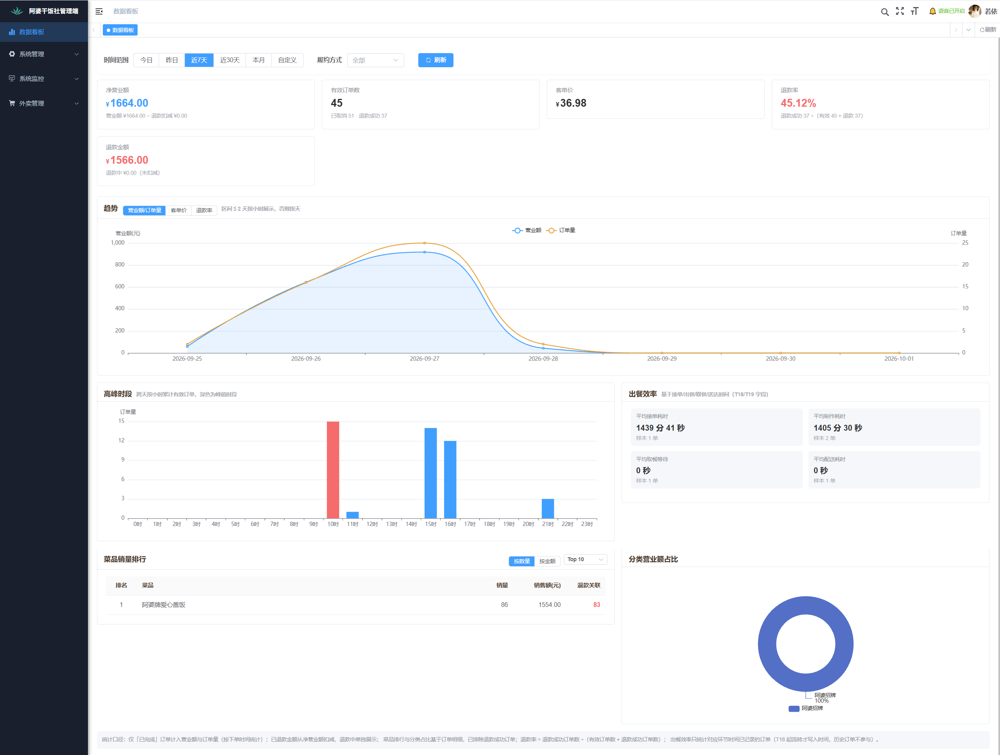

**小票打印**——80mm 热敏厨房出餐单（浏览器打印，可另存 PDF）：

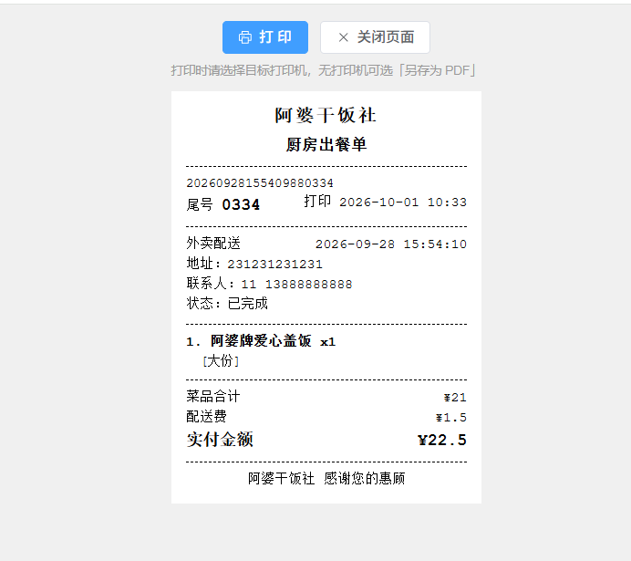

**AI 知识库**——文档上传、异步解析状态、切片数、重新解析/删除（同步清理向量）：

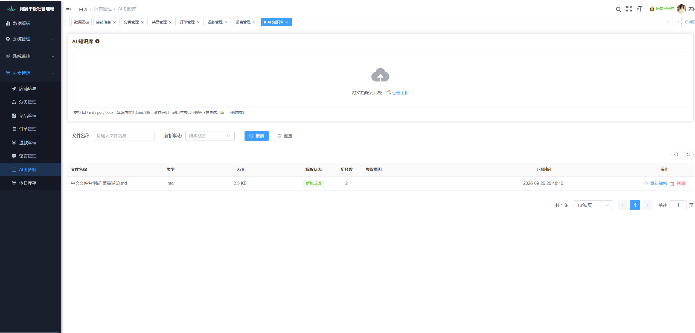

## 快速开始

### 0. 环境要求

- JDK 17、Maven 3.8+、Node.js 16+、Docker（含 Docker Compose）
- 微信开发者工具（导入 `takeout-uniapp`）

### 1. 启动中间件（MySQL + Redis + RocketMQ）

```bash
cd ruoyi-takeout-shop
docker compose up -d
```

### 2. 初始化数据库

按顺序执行 `ruoyi-takeout-shop/sql/` 下的脚本（容器名 `takeout-mysql`，账号 root/root，库名 takeout）：

```bash
docker exec -i takeout-mysql mysql -uroot -proot takeout < ruoyi-takeout-shop/sql/ry_20260417.sql      # 若依基础表
docker exec -i takeout-mysql mysql -uroot -proot takeout < ruoyi-takeout-shop/sql/quartz.sql           # 定时任务表
docker exec -i takeout-mysql mysql -uroot -proot takeout < ruoyi-takeout-shop/sql/ruoyi-takeout.sql    # 业务表
docker exec -i takeout-mysql mysql -uroot -proot takeout < ruoyi-takeout-shop/sql/ruoyi-takeout-menu.sql
docker exec -i takeout-mysql mysql -uroot -proot takeout < ruoyi-takeout-shop/sql/ruoyi-takeout-job.sql
docker exec -i takeout-mysql mysql -uroot -proot takeout < ruoyi-takeout-shop/sql/ruoyi-takeout-ai.sql
# 其余 ruoyi-takeout-*.sql / t18 / t19 / t20 为各迭代增量脚本，按文件名顺序执行
```

### 3. 启动后端（端口 4121）

```bash
cd ruoyi-takeout-shop
mvn -pl ruoyi-admin -am package -DskipTests
java -jar ruoyi-admin/target/ruoyi-admin.jar
```

> AI 问答功能需要配置环境变量 `DASHSCOPE_API_KEY`（阿里云百炼 API Key），不使用 AI 功能可不配置。

### 4. 启动商家管理端

```bash
cd ruoyi-takeout-shop-web
npm install
npm run dev
```

浏览器访问 http://localhost:80  **（vite 输出的地址）**，默认账号 **admin / admin123**。

### 5. 启动小程序端

1. 微信开发者工具导入 `takeout-uniapp` 目录（详情见 `takeout-uniapp/manifest.json`，需替换为你自己的小程序 appid）；
2. 本地联调可在 `application.yml` 将 `wx.mock-enabled` 设为 `true`（登录 code 直接作为 openid，跳过微信接口）；
3. 勾选「不校验合法域名」后编译预览。

## 目录结构

```
├── ruoyi-takeout-shop        # 后端（RuoYi-Vue 多模块）
│   ├── ruoyi-merchant        #   商家管理端业务模块（订单/退款/看板/统计/推送）
│   ├── ruoyi-user-api        #   小程序端 /api 接口服务
│   ├── ruoyi-admin           #   启动模块（端口 4121）
│   ├── ruoyi-framework / ruoyi-system / ...  # 若依框架模块
│   ├── sql/                  #   建表与增量 SQL
│   └── docker-compose.yml    #   MySQL + Redis + RocketMQ 一键环境
├── ruoyi-takeout-shop-web    # 商家管理端前端（Vue3 + Element Plus）
├── takeout-uniapp            # 顾客端微信小程序（uniapp + wot-design-uni）
└── docs/                     # 项目截图（docs/images/）、测试操作手册、AI 知识库示例数据
```

## AI 智能问答（RAG）技术介绍

小程序内置点餐助手「问问阿婆」：顾客可以问"感冒了想吃清淡的推荐什么"这类问题，助手基于**商家上传的知识库**和**当前在售菜品**回答，而不是凭空编造。

### 整体链路

```text
【离线：知识库构建】商家管理端
  上传文档（txt/md/pdf/docx）
    → Apache Tika 解析正文
    → TokenTextSplitter 按段落 + token 长度切片
    → Embedding 模型向量化（通义 text-embedding）
    → 写入 Redis 向量库（RediSearch，索引 takeout-ai-index）
    → 后台线程异步解析，管理端可查看解析状态 / 重新解析 / 删除（同步清理向量）

【在线：问答检索】小程序端
  用户提问
    → 问题向量化 → VectorStore 相似度检索 TopK 片段（带相似度阈值过滤）
    → 组装 System 提示词：
        · 点餐助手角色约束：只依据知识库内容与在售菜品回答，检索不到的明确说不知道（防编造）
        · 健康类问题给出推荐菜品与理由，并注明建议仅供参考
        · 实时注入【当前在售菜品列表】（复用业务表查询，保证推荐可下单）
    → ChatClient 生成回答（携带最近多轮历史，支持多轮对话）
```

### 技术选型与设计要点

| 点 | 说明 |
|---|---|
| Spring AI | 统一 `ChatClient` / `EmbeddingModel` / `VectorStore` 抽象，走 OpenAI 兼容协议（默认阿里云百炼/通义，可一行配置切换 DeepSeek 等兼容网关） |
| 向量库选 Redis | 项目本就依赖 Redis，用 RediSearch 建向量索引（`RedisVectorStore`）**不新增中间件**，本地 docker-compose 即可跑通；文档删除时同步删除向量，避免脏检索 |
| 防编造（Grounding） | System 提示词强制"只依据知识库与在售菜品、没有就明说"，检索为空时自动退化为纯菜品推荐，不影响可用性 |
| 实时菜品注入 | 在售菜品不走向量库，而是每次问答实时查业务表注入提示词——菜品价格/售罄状态永远与点餐一致 |
| 多轮 + 流式 | 会话与消息落库（多轮上下文），支持流式输出（打字机效果） |
| 异步解析 | 文档解析/向量化在独立线程池执行，不阻塞管理端操作；解析状态可追踪、可重试 |

> 模型 API Key 通过环境变量 `DASHSCOPE_API_KEY` 注入，不写入代码与 Git。

## 关键配置说明

| 配置 | 位置 | 说明 |
|---|---|---|
| `payment.mock.enabled` | application.yml | 模拟支付开关（默认 true，上线必须关闭并接入真实支付） |
| `wx.mock-enabled` | application.yml | 微信登录 mock（本地联调用，上线必须 false） |
| `rocketmq.enabled` | application.yml | MQ 降级开关，false 时超时关单仅靠定时任务 |
| `DASHSCOPE_API_KEY` | 环境变量 | AI 问答的模型 API Key，不入库不入 Git |
| `takeout.file.base-url` | application.yml | 图片访问前缀（本地/OSS 可切换） |

## 致谢

- 后端与管理端基于开源项目 [RuoYi-Vue](https://gitee.com/y_project/RuoYi-Vue)（MIT License）二次开发；
- 小程序端 UI 基于 [wot-design-uni](https://wot-design-uni.cn/) 组件库定制可爱风主题；
- 项目定位为个人学习项目，界面素材与品牌均为虚构，请勿用于真实商业经营。

## 支持

如果这个项目对你有帮助、或者你觉得做得还不错，欢迎点个 ⭐ **Star** 支持一下，也欢迎 Fork 交流和提 Issue～
